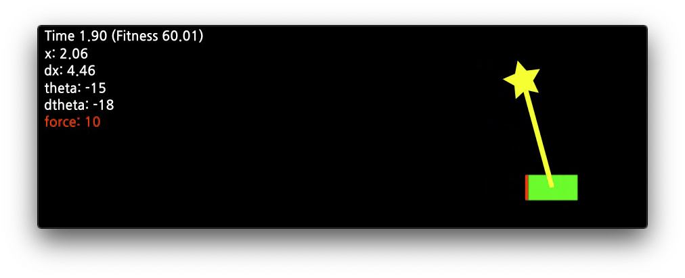

# Single-Pole Balancing

Single-pole balancing A.I. using NEAT for Python

## Dependency

- Python 3
- [neat-python](https://github.com/CodeReclaimers/neat-python)
- gizeh (for visualization)
- OpenCV (for visualization)

## Reference

- https://github.com/CodeReclaimers/neat-python/tree/master/examples/single-pole-balancing